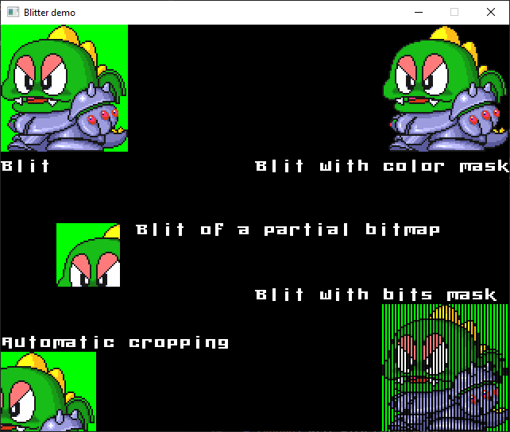

# blitter

[](https://crates.io/crates/blitter)
[](https://crates.io/crates/blitter)

This library performs various blitting and drawing operations on a raw 32 bits framebuffer, whatever the encoding.
- Bitmap blitting / cropping
- Blit a part of bitmap (ie. bitmap fonts)
- Blit with a color or bits mask
- Pixel plotting
- Optional PNG decoding feature

Example:
```
// Framebuffer initialization
let mut pixels: Vec<u32> = vec!(0; WIDTH * HEIGHT);
let mut fb = Framebuffer {width: WIDTH, height: HEIGHT, pixels: &mut pixels};

// For example, you can push all the bitmaps in a single vec to give ownership of all bitmaps
let mut bitmaps = Vec::new();
bitmaps.push(Bitmap {w: 10, h: 10, x: 0, y: 0, pixels: &image::PIXELS});

while *display loop with some display library* {
    blitter_test(&mut fb, &mut bitmaps);
    *your display lib display update function with buffer &fb.pixels*
}

// For testing : moves a 10x10 square and prints a 4x4 pixel at the center of the screen
fn blitter_test(mut fb: &mut Framebuffer, bitmaps: &mut Vec<Bitmap>) {
    fb.clear_area(640, 10, 0, 0, 0).unwrap();
    bitmaps[0].blit(&mut fb).unwrap();   //copies a bitmap to the framebuffer
    if bitmaps[0].x < WIDTH - 10 { bitmaps[0].x = bitmaps[0].x+3; } else { fb.clear(0); }
    fb.draw_fatpixel(320,240,4,0xffffffff).unwrap();
}
```

You can also view and run some (very basic) examples using the [minifb library](https://crates.io/crates/minifb) in the 'examples' directory:
```
cargo run --example demo --features="png-decode"
cargo run --example minifb --features="png-decode"
cargo run --example square
```

[]

License: GPL-3.0
